# 02 — Architecture

## Components

```
crates/                                       (in-process Rust)
├── polyref-core           types, ids, status, evidence, observation, report — no I/O
├── polyref-checker-spi    JSON-RPC envelope + extractor / kind-checker SPI types
├── polyref-graph          Repository graph, GraphStore, MigrationMap, ObservationRegistry      [Layer 1+]
├── polyref-loader         Reproducible checkout + sandboxed apply(R, ρ)                         [Layer 2+]
├── polyref-frontier       ∂ρ(o) least-closure                                                   [Layer 5+]
├── polyref-engine         Algorithm A1 + A2                                                     [Layer 6+]
├── polyref-rewriter       μ(o) for api / build / workflow / test                                [Layer 7+]
├── polyref-report         JSON + Markdown emitters                                              [Layer 7+]
└── polyref-cli            polyref validate / replay / explain / prefetch                        [Layer 8+]

plugins/                                      (subprocess; JSON-RPC over stdio)
├── extractor-{typescript, python, openapi, jsonschema, sql, yaml-actions,
│              dockerfile, package-manifest, java}
└── checker-{route, schema, build-codegen, workflow, query-table, event,
            generated-client, test-oracle, serialization, configuration}

coq/    Abstract preservation theorems (Layer 10)
eval/   Empirical harness — subjects, tasks, baselines, analysis (Layer 11)
docs/   Project documentation
```

## High-level data flow



## Domain model



Aggregate invariants:
- `Repository` is immutable once built. `R` and `R'` are distinct aggregates.
- `ValidationReport.candidateDecision` is derived from `Evidence` only; never set imperatively.
- `Evidence.outcome` is the single source of truth for status. `Pres` and `Migrated` carry no reason at the type level.
- `MigrationMap.tryNew` accepts a rewrite iff the *kind* segment of the EntityIds matches (paper Definition 5). Cross-language migrations are first-class.

## Algorithm A2 (status assignment)

The order is load-bearing; every implementation must preserve it (test-locked in `polyref-engine`).

```
for each frontier item x:
    1. if checker is unsupported or timed out, or required source evidence is missing
       → Unknown(reason)
    2. else if a required compat / migrate / local / build predicate is concretely refuted
       → Broken(reason)
    3. else if endpoints of x are rewritten by μ AND the migrate predicate holds AND μ(o) is defined
       → Migrated
    4. else if endpoints unchanged AND well-typed in R' AND compat predicate holds
       → Pres
    5. else
       → Unknown(NoAcceptingRuleApplied)
```

## Plugin SPI

Plugins are separate processes spoken to over JSON-RPC 2.0 on stdio (ADR-002). Two SPI families:

- **Extractor** — one method `extract(ExtractRequest) → ExtractResult`.
- **Kind checker** — `describe() → DescribeResult`, then `check(CheckRequest) → Evidence`.

Host enforcement:
- Per-call cgroup CPU + memory + wallclock limits.
- Read-only mount of repo source; writable scoped log directory only.
- Per-call deterministic stdin canonicalization → cache key for memoization and replay.
- Plugin crash, malformed output, or timeout → `Unknown(PluginFailure | CheckerTimeout)`.

## Persistence

| Store | Backing | Purpose |
| --- | --- | --- |
| GraphStore | SQLite (one file per repo: `repo-old.sqlite`, `repo-new.sqlite`) | Entities, correspondences, build edges, observations |
| ArtifactStore | content-addressed filesystem (`cache/blobs/sha256/…`) | Memoize extractor outputs; store evidence blobs |
| AuditLog | NDJSON, append-only per run | Every stage transition |
| ReportStore | One directory per `report_id` with `report.json`, `report.md`, `evidence/*.log`, `manifest.json` | Replayable report artifacts |

Memoization keys:
- Extractor: `H(content_hash, extractor_id, extractor_version, options)`.
- Kind checker: `H(plugin_version, contract_id, sorted endpoint_entity_ids, evidence_inputs_hash, deadline_ms)`.

## Concurrency

- Extraction is parallel per artifact, bounded by `min(num_cpus, 8)`.
- Frontier computation is parallel across observations, serial within each observation.
- Kind-checker calls fan out per `(observation, frontier_item)` through bounded queues — one queue per kind plugin.
- Status assignment runs through a single-task reducer that consumes results in lexicographic `(observation_id, item_id)` order, so two runs of the same input produce byte-identical reports.

## Security

The sandbox stack (ADR-009):

1. Outer rootless container — read-only repo mount, writable cache, no network.
2. Per-call `nsjail` (Linux) or `sandbox-exec` (macOS dev): dropped capabilities, seccomp, no `ptrace`/`mount`/`chroot`, per-call cgroup CPU + memory + tmpfs cap.
3. Plugin stdin payloads bounded (default 16 MiB, depth 64). Malformed JSON or oversize → `Unknown(PluginFailure)`.
4. `SafePath` newtype wrapping `String`: only relative POSIX paths under a sandbox root; absolute paths, parent-traversal, NUL, control codepoints, bidi overrides, and zero-width characters are rejected at parse time.
5. Outbound network denied by default. Generators that need a registry must be pre-fetched.
6. `unsafe_code` is forbidden in every crate.

## Observability

- Structured logs (NDJSON, one event per stage transition).
- Prometheus metrics: `polyref_stage_seconds`, `polyref_checker_outcome_total`, `polyref_unknown_reason_total`, `polyref_frontier_size`, `polyref_missing_endpoint_unknown_total`.
- OpenTelemetry traces: one span per stage; child spans per checker call.
- Replayability is a CI gate: re-running a report from cache must produce byte-identical output.

## KPI and SLO

| KPI | Target |
| --- | --- |
| Median validation latency | ≤ 30 min on a 4 vCPU / 16 GB worker |
| p95 validation latency | ≤ 60 min |
| Accepted false-accept rate | ≤ 0.12 (held-out + seeded oracle) |
| Accepted-rows fail-closed leakage | 0 |
| Extractor precision (audited) | ≥ 0.83 |
| Extractor recall (audited) | ≥ 0.79 |
| Replayability | 100 % byte-identical |

## Risk register

| Risk | Mitigation | Trigger to revisit |
| --- | --- | --- |
| Extractor incompleteness on reflective frameworks | Fail-closed → `Unknown`; admit dynamic traces under ADR-004 | `Unknown` rate > 30 % on a target stack |
| Build-system modeling for monorepos | Bounded-fragment scope; opaque cache → `Unknown` | A target subject has > 20 % `Unknown` from build cause |
| LLM nondeterminism in baseline runs | Pin model id, temperature 0, retry budget recorded | Baseline FA-rate variance > 0.05 |
| 43-min budget overrun | Memoization keyed by content + versions; parallel sweep | Median > 30 min after Layer 12 |
| Plugin crash storm | Bounded plugin pool; supervised restart with backoff | > 1 % plugin failures per task |
| Coq drift vs implementation | Implementation tests mirror named theorems | Any Coq theorem renamed without paired test rename |
| Sandbox escape via untrusted candidate | Defense in depth; security review before v1 | CVE on chosen sandbox; pen-test finding |
| Subject curation pipeline broken | Inclusion criteria as code; CI rejects subjects missing fields | < 30 reproducible subjects after Layer 12 |
